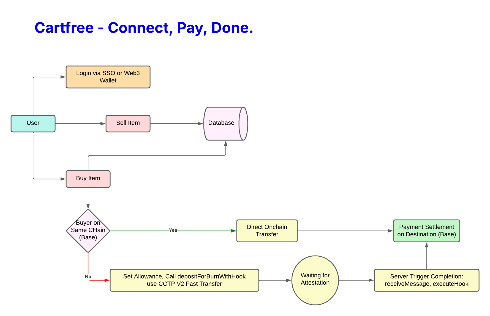

# Cartfree - Connect, Pay, Done.

Cartfree is a marketplace and multichain USDC payment platform that utilizes Fast Cross Chain Transfers using CCTP v2 for real world utilization and low-friction adoption. Cartfree is being developed as a production‑grade project.

## Quick summary
- Purpose: Accept and finalize USDC payments across multiple EVM chains using CCTP v2 fast transfers and hooks; target real‑world stablecoin adoption with a smooth, consumer‑friendly experience.
- Tech: Next.js (app router) frontend, viem/wagmi for on‑chain interactions, Supabase for persistence, Solidity smart contracts developed with Hardhat, and a set of server APIs to orchestrate CCTP finalization flows.
- UX & settlement model: Sellers receive consolidated settlement on the Base or other destination network (via the deployed Hook Executor) while buyers can originate payments from Ethereum, Arbitrum, Base or other CCTP‑supported chains. Users can onboard either via SSO (e.g., Google) for a familiar flow or using non‑custodial wallets for self‑custody.

## Features
- Multichain receive + finalize flow using CCTP v2
- Hook execution on destination via deployed hook contract
- Marketplace feature with listings, buy flow and order tracking
- Dashboard to view hashes and transaction status
- Minimal server-side orchestration to call receiveMessage and executeHook

## Deployed contracts / Verification links
- Hook executor contract (CCTP v2 Hook) deployed on Base Sepolia:  
  https://sepolia.basescan.org/address/0x8ae4bb6b48c211072d3dee6cd9734a906450623c

- Example origin chain address where cross USDC transfer can be checked (Sepolia Arbitrum):  
  https://sepolia.arbiscan.io/address/0x6b55728376b4e9c0dacd152110f5b49913fe9b84

## How the CCTP flow is used in this repo
1. Seller or system initiates a cross‑chain transfer / depositForBurnWithHook that results in an attestation from the origin chain.
2. The server API finalizes the transfer on the destination chain by:
   - calling `receiveMessage` on the MessageTransmitter contract (using the relayer account)
   - calling `executeHook` on the HookExecutor contract (the deployed hook above)
3. Hook logic can perform recipient payouts, treasury rebalancing, or other post‑transfer actions.

## Future roadmap
- Add support for more CCTP‑supported chains and automated discovery of destination RPC endpoints.
- Provide a library of hook templates (treasury rebalancer, instant payouts, notifications) that can be deployed and configured by merchants.
- Build an on‑chain settlement reporting dashboard for multi‑merchant reconciliation and CSV exports.
- Integrate on‑ramp/off‑ramp and fiat rails for improved merchant onboarding.
- Implement automatic gas sponsorship and relayer scaling for production environments.

## Where to look in the repo
- `appserver/src/app/api/cctp/completeTransfer/route.ts` — Simplified receiveMessage + executeHook orchestration.
- `appserver/src/components/OrderCard.tsx` — UI showing transaction hashes with copy button.
- `appserver/src/lib/performBuy.ts` — Core buy flow (bridging + settlement orchestration).
- `smart-contracts/` — Hook executor and support contracts.
